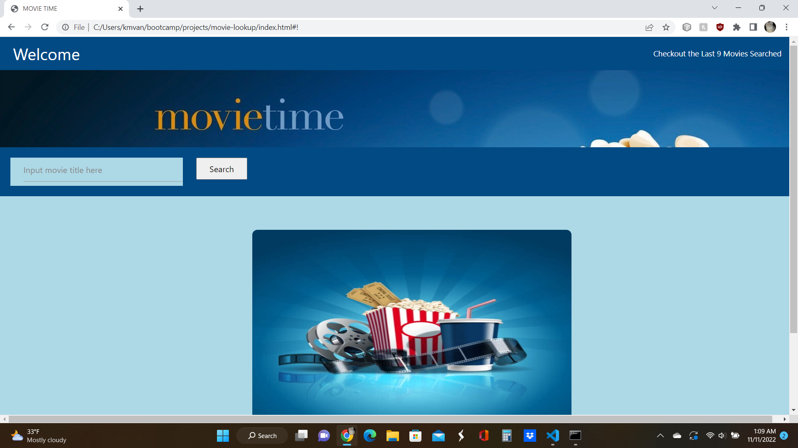
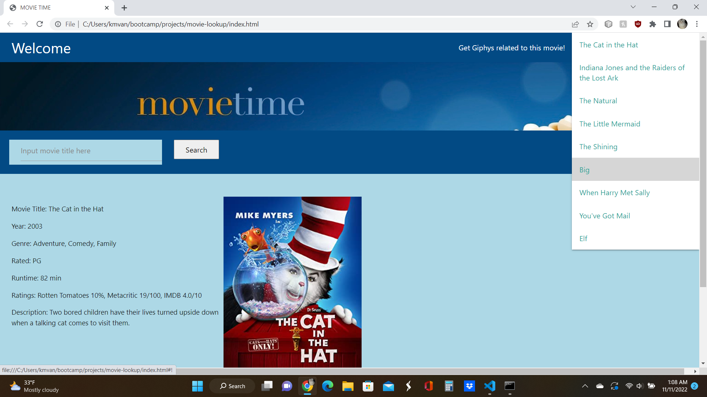
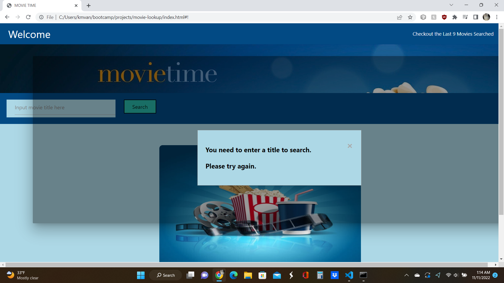
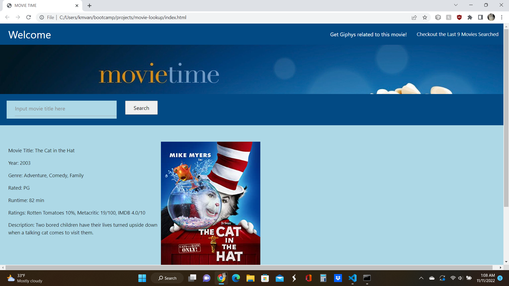
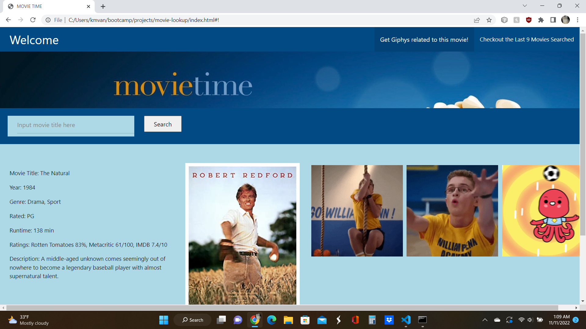

# Movie Time (working title - movie-lookup)

## Description

This program uses OMDB API to look up movie data and GIFFY API to get related gifs 

- group project for UW coding bootcamp
- used materialize to make dropdowns and other features
- created a design and implemented it with HTML and CSS
- created an init function to load the page
- created eventlisteners for buttons and drop down to initialize function on click
- created functions to make calls to two APIs to get data needed
- created functions to get and set movie title array in local storage
- created index.html, style.css, script.js
- Created a read.me

## Technologies Used

- Materialize
- JQuery
- HTML
- CSS
- W3 Schools

## Screenshots
### Screenshot of Screen on Start Up with Saved Movie Array

### Screenshot of working dropdown

### Screenshot of error displayed in modal

### Screenshot after movie searched

### Screenshot showing gifs

## Link to Project

[https://vanwykkim.github.io/movie-lookup/]

## Contributors

Movie Nijas - primary rolls
- Dez: CSS
- Rodd: HTML
- Faruk: Javascript
- Kim: Javascript

## Credits

used this API with JSON for movie data 
[OMDB](https://www.omdbapi.com/)

used this API with JSON for gifs
[GIPHY Developers](https://api.giphy.com/)

## License

Please refer to the LICENSE in the repo.